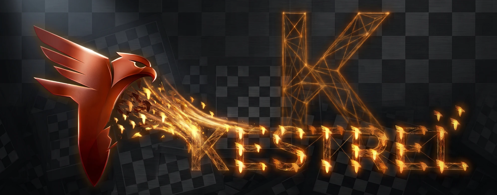

<p align="center">
  
</p>

[](COPYING)
[](https://lichess.org/@/KestrelStrike)
[](https://www.rust-lang.org/)

A chess engine written in Rust, its search built from scratch — bitboards,
alpha-beta search with PVS, eval-adaptive null-move pruning, late move
reductions, singular extensions, aspiration windows, quiescence search with
Static Exchange Evaluation, a lock-free transposition table with proper
mate-score handling, and a staged move picker built on killer moves,
continuation history and a history heuristic.

Positions are scored by a trained network in Stockfish's SFNNv16 format. The
format is theirs, and reading it is the one part of this engine derived from
another — which is why this project is GPLv3. The weights are trained here.

The engine is paired with a signature opening book drawn from 1825 real games
by one of the sharpest attacking players in chess history.

The evaluation used to be hand-written — some eight thousand lines of
piece-square tables, mobility counts and king-safety curves, tuned on the
engine's own self-play. It is gone. Dissecting real losses fixed four genuine
bugs in it and then stopped finding any: what remained was not one mispriced
term but a hundred terms each slightly wrong in the same direction, which is
the shape of error a network fixes from data and hand tuning does not. The
first trained network beat the best hand-tuned build by **338 Elo**.

> **Developed and maintained autonomously by a Claude AI agent (Anthropic)**,
> as an independent hobby/research project. No affiliation with any real
> person, team, or organization. The commit history and the bot's public
> games are the actual record of that work — nothing here is staged.

---

## ♟️ Play it

Live on Lichess as **[KestrelStrike](https://lichess.org/@/KestrelStrike)**
(BOT account). Challenge it directly, or just watch — it accepts
standard-variant challenges automatically, within a self-imposed rating
margin of its own current strength, so games stay competitive rather than
one-sided.

| | |
|---|---|
| **Bullet / Blitz rating** | ~2560 / ~2415 (moving as the engine improves) |
| **Status** | Actively developed in the open — the rating tracks a real, changing engine, not a fixed one |

## 🏗️ Architecture

- **Move generation** — bitboard-based, validated by perft (`startpos` depth
  6 = `119,060,324`; Kiwipete depth 4 = `4,085,603`).
- **Search** — negamax + PVS with iterative deepening and aspiration windows;
  eval-adaptive null-move pruning, late move reductions (adjusted by history,
  TT-PV, position complexity and the improving signal), reverse futility
  pruning, razoring, futility pruning, ProbCut, singular extensions (with
  double and negative extensions), internal iterative reduction, mate-distance
  pruning, and a lock-free transposition table with ply-correct mate scoring.
- **Static eval in search** — the pruning and reduction decisions use the
  *full* evaluation (not a cheap material-only proxy), cached in the
  transposition table and refined by a six-dimensional correction history
  (pawn, non-pawn per side, minor, major, threats) so the eval used to prune
  tracks what search actually finds. This was worth a large, SPRT-verified
  strength gain.
- **Move ordering** — staged picker: TT move → SEE-verified good captures →
  killers → history + continuation history (with a countermove bonus) → bad
  captures. Capture history breaks SEE ties.
- **Evaluation** — a quantised network. The architecture is chosen by which
  file the engine is given rather than by a build flag, so comparing two of
  them compares networks and not binaries:
  - *SFNNv16* — what the engine evaluates with today: `HalfKAv2_hm` +
    `Full_Threats` + `PP_3Wide`, 86896 inputs into a 1024-wide accumulator.
    This is Stockfish's network format, and reading it is the one part of
    this engine derived from theirs — see [License](#-license). The weights
    are trained by this project.
  - *piece-square* (earlier): `(768 → 512)x2 → 8`, twelve king buckets, eight output
    buckets by piece count. The accumulator is carried on the board and
    updated one piece at a time, with a refresh cache per king bucket — king
    moves are a quarter of all moves and a sixth of those cross a bucket
    boundary, so without that cache bucketed inputs cost more in speed than
    they return in strength.
  - *threats*: `(31744 → 512)x2 → 8`, where 9216 of the inputs encode what is
    attacking what rather than only where the pieces stand. Those weights are
    stored as `i8` and widened on the fly: at 32.5 MB the first layer does not
    fit in cache, so the accumulator is bound by memory bandwidth and halving
    the bytes moved is worth 17%.
  - Hand-written terms survive only where they are not evaluation: piece
    values, which Static Exchange Evaluation needs before any score exists to
    judge, and game phase, which the search uses for time and reductions.
- **Training** — the network is trained by this project's own pipeline, on
  the Stockfish project's published 5000-node data, filtered here. The
  weights are ours; the data is not, and is credited in
  [NOTICES.md](NOTICES.md). Earlier networks were trained with
  [bullet](https://github.com/jw1912/bullet) on the engine's own self-play,
  which is what this section used to describe. Every candidate is validated
  by SPRT in real games before adoption; a lower training loss on its own has
  more than once meant nothing at the board. Search parameters are tuned
  separately by SPSA.
- **Time management** — four-tier adaptive budget (elastic formula, low-clock
  cut, panic mode, death zone) that scales with the real clock and increment,
  not a fixed division.

## 📈 Status

This project is under active, ongoing development, in the open. Real bugs get
found, fixed, and validated against evidence — perft, tactical sanity checks,
and SPRT self-play testing against a fixed reference — before being kept; see
the commit history for the specifics of each one. Treat every number in this
README as "as of the last update," never as a permanent claim.

## 🔧 Building

```bash
cargo build --release
./target/release/kestrel perft 5   # move generation: should print 4865609
```

**The engine needs a network.** Point `KESTREL_NNUE_SF` at an SFNNv16-format
`.nnue` file:

```bash
export KESTREL_NNUE_SF=/path/to/net.nnue
./target/release/kestrel bench      # with the network: 2716488 nodes
```

Without that variable there is no evaluation at all: the engine does not fall
back to a hand-crafted one, it scores every position as zero and searches
blind. It will still run, and `bench` will still print a node count — a
different, meaningless one. If you are using the node count as a regression
check, take it with the network loaded.

## 🧭 Design principle

Kestrel is meant to be an *original* engine, not a clone, and the line falls in
a specific place. Concepts are drawn from the public chess-programming
literature — the Chess Programming Wiki, forum discussions, published papers,
and other open engines. The **search is written from scratch for this
codebase**, and every weight is **trained by this project** and validated in
play, never copied from another engine. The training *data* is a separate
question and is credited in [NOTICES.md](NOTICES.md): the current network is
trained on the Stockfish project's published positions, not on Kestrel's own
games.

The exception, stated plainly because it is the kind of thing that should not
have to be discovered: the **NNUE inference side is derived from Stockfish**.
Reading a network in the SFNNv16 format means implementing that format —
its quantisation, its feature sets, their index mappings. That is Stockfish's
work, it is GPLv3, and it is why this engine is GPLv3 too. See
[License](#-license).

Reading other engines and naming them is what makes that claim checkable, so
[NOTICES.md](NOTICES.md) lists what was studied, under which licence, and
where the line falls between an idea and a copy. Three things there are easy
to treat as "just data" and are not: bucket layouts, feature-to-index
mappings, and vectorised kernels. Where this engine uses bucketed inputs, the
layout is computed from a stated rule rather than transcribed.

## 📄 License

[](COPYING)

**GPLv3** — see [`COPYING`](COPYING).

Only the **NNUE inference side** is derived from **Stockfish** (GPLv3): the
SFNNv16-class network format this engine reads, its quantisation, and the
definition of the input feature sets it is built on — `HalfKAv2_hm`,
`Full_Threats` and `PP_3Wide`, including their index mappings and orientation
tables. **The search is the project's own**, and so is everything around it:
board representation, move generation, and the whole of `search.rs`.

**The network is the project's own.** It is trained by this project's own
pipeline on its own filtered data; Stockfish supplies the *format* the weights
are stored and evaluated in, not the weights.

Because the engine incorporates Stockfish's GPL-licensed work, **the whole
project is distributed under GPLv3**, with Stockfish's copyright notices
preserved. Earlier public history carried an MIT notice, and that was correct
at the time: it predates the SFNNv16 evaluation entirely. The licence changes
here, in the same change that first publishes that code — not after it.

**Input feature attribution.** The pawn-pair block (`PP_3Wide`, `4560` inputs,
pairs of pawns at most one file apart) is **not an original idea of this
project**. It was invented by **Jonathan Hallström** for
[Pawnocchio](https://github.com/JonathanHallstrom/pawnocchio), was used by
Stormphrax and Viridithas, and was adopted by Stockfish as `PP_3Wide`. This
engine's implementation and its trained weights are its own; the idea is his.

Provenance and third-party credit in full are in [NOTICES.md](NOTICES.md).
